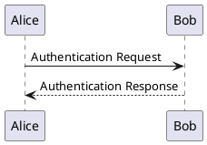

# 阶段 6: 截图与演示 —— 3 秒抓住人

> 顶尖仓库的 README 第一屏永远是图(或 GIF)。
> 没有图 = 文字墙 = 关掉。
> 这一阶段让仓库"看一眼就懂"。

## 目标

- [ ] README 顶部有 1-2 张图(GIF / 截图 / 架构图)
- [ ] 演示能 5-15 秒看完
- [ ] 截图压到 < 2MB,GIF 压到 < 5MB
- [ ] 图本身是"活的"(光标、动画、终端),不是静态 banner

## 6.1 选哪种图

| 形式 | 适合 | 工具 | 准备时间 |
|---|---|---|---|
| **终端录屏 GIF** | CLI 工具 | vhs / asciinema / terminalizer | 10 min |
| **应用截图** | GUI / 桌面 / Web | 系统截图 + 标注 | 5 min |
| **架构图** | 库 / 框架 / API | excalidraw / mermaid | 15 min |
| **Logo / Banner** | 品牌化项目 | figma / canva | 30 min |
| **动效(3D / WebGL)** | 视觉冲击项目 | 录屏工具 | 20 min |

**优先级:终端 GIF > 应用截图 > 架构图 > Logo**。前两个最能说明"它能做什么"。

## 6.2 终端录屏(CLI 项目必做)

### 工具 1: vhs(推荐,最简单)

```bash
brew install vhs
```

写一个 tape 文件:

```tape
# demo.tape
Output demo.gif
Set FontSize 14
Set Width 1200
Set Height 600
Set Theme "Dracula"
Set Padding 20

Type "my-tool --help"
Enter
Sleep 1s

Type "my-tool init"
Enter
Sleep 2s

Type "my-tool run --config example.yaml"
Enter
Sleep 4s
```

跑 `vhs demo.tape`,输出 demo.gif。

### 工具 2: asciinema(可嵌网页,体积小)

```bash
brew install asciinema
asciinema rec demo.cast
# 操作完按 Ctrl+D 结束
```

转 GIF:
```bash
brew install agg
agg demo.cast demo.gif
```

### 工具 3: terminalizer(全 GUI)

```bash
npm install -g terminalizer
terminalizer record demo
# 操作完 Ctrl+D
terminalizer render demo
```

### 录屏技巧(避免翻车)

1. **录之前先 clear 干净** —— 残留命令看着乱
2. **第一帧是 idle 状态** —— 不要黑屏滚动 3 秒
3. **节奏要慢** —— 命令执行后 `Sleep 2-3s` 看输出
4. **最后停在一个状态** —— 不要录到一半断
5. **出错也保留** —— 真实比完美更可信(但要在 README 标注"warning: this is in progress")

### 压缩(超重要!)

```bash
# 用 gifsicle 压
brew install gifsicle
gifsicle -O3 --lossy=80 demo.gif -o demo-compressed.gif

# 或用 gifski(质量更好,文件稍大)
brew install gifski
gifski --fps 20 --quality 80 -o demo.gif frame*.png
```

目标: < 5MB。如果还大,降分辨率或帧率。

## 6.3 应用截图(GUI / Web / 桌面)

### 工具

- **macOS**: `Cmd+Shift+4` 区域截图,或 `Cmd+Shift+5`
- **Windows**: `Win+Shift+S` 截图工具
- **Linux**: `gnome-screenshot` / `flameshot`

### 截图规范

1. **窗口背景统一** —— 杂乱的桌面背景 = 减分
2. **光标在关键位置** —— 引导视线
3. **关掉无关标签** —— 只显示相关视图
4. **分辨率不要太大** —— 1440x900 最佳
5. **格式用 PNG** —— 比 JPG 锐利,大小可接受

### 标注(可选)

用 `Skitch` / `Shottr` / `Preview` 加红框、箭头、文字。

**重要**:标注只在"非显然"的地方加,不要每张图都堆满箭头。

## 6.4 架构图

### mermaid(最简单,README 直接渲染)

```markdown
\`\`\`mermaid
graph LR
  A[CLI Input] --> B[Parser]
  B --> C[Validator]
  C --> D[Executor]
  D --> E[Output]
  E --> F[User]
\`\`\`
```

GitHub README 原生支持 mermaid,不用配图。

### excalidraw(手绘风,活人感强)

- https://excalidraw.com/ 画
- 导出 PNG / SVG
- 放进 `docs/architecture.excalidraw`(可编辑) + `docs/architecture.png`(展示)

### PlantUML(严肃风)



适合大型项目。

## 6.5 Logo / Banner(可选,品牌感)

**做不做看项目:**
- 个人小工具:**不必**
- 库 / 框架 / 长期维护项目:**值得**

### 简单做

- 用 `https://shields.io/endpoint?logo=...` 生成带 logo 的 badge
- 拼成一个 banner

### 认真做

- Figma / Canva 设计
- SVG 格式优先(任何分辨率清晰)
- 多个尺寸:`og-image.png`(1200x630,社交分享用)

## 6.6 视频(高级)

如果想更生动:

- **YouTube** 录一段 2-3 分钟教程
- 在 README embed:`[](https://youtu.be/xxx)`

不建议作为主要演示,GitHub 用户不爱点外链。

## 6.7 放置策略

### README 顺序

```
1. Title + Badges
2. 演示图 ⬅️ 第二屏
3. Features
4. Why this exists
5. Quick Start
6. ...
```

**演示图是第二屏,不是最后**。第一屏(标题 + badge)抓人,第二屏(图)让人懂。

### 多个图怎么放

- **Tab 切换式**(用 `<details>` / `<picture>`):
```markdown
<picture>
  <source media="(prefers-color-scheme: dark)" srcset="docs/demo-dark.png">
  <source media="(prefers-color-scheme: light)" srcset="docs/demo-light.png">
  
</picture>
```

- **Carousel**(用 `` 列表 + 注释分隔)

## 6.8 阶段 6 退出标准

- [ ] README 顶部 1-2 张图
- [ ] 图的格式正确(PNG/GIF,分辨率合理)
- [ ] 文件 < 5MB(GIF)/ < 2MB(PNG)
- [ ] 5-15 秒能看懂"这项目干嘛的"

---

## 下一个:阶段 7 个人信息与活人感
